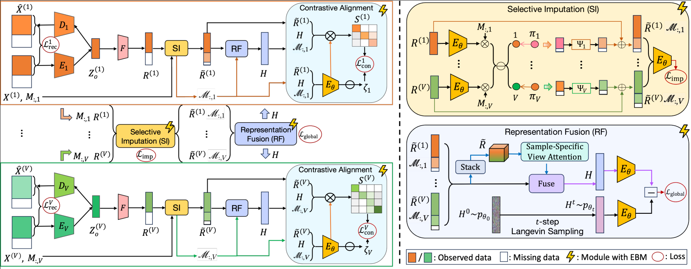

# Energy-Based Deep Incomplete Multi-View Clustering

## Introduction

This repository implements an energy-based multi-view clustering framework that effectively handles missing data through energy-guided feature imputation. The approach leverages energy networks to guide the imputation of missing features and enhance contrastive learning, thereby improving clustering performance in multi-view scenarios with incomplete data.

## Key Features

- **Energy-based Feature Imputation**: Uses energy networks to guide the imputation of missing features
- **Multi-head Attention Mechanism**: For adaptive fusion of features from different views
- **Energy-Enhanced Contrastive Learning**: Leverages energy networks to enhance representation learning
- **Missing Data Handling**: Robust performance even with significant missing data rates
- **Support for Multiple Datasets**: Works with standard multi-view clustering benchmark datasets

### Usage
python main.py --dataset=hand --num_heads=4 --learning_rate=0.0017593568650436865 \
  --feature_dim=78 --hidden_dim=222 --dropout=0.49682483698160845 \
  --imputation_loss_weight=0.32522256029396907 --cd_loss_weight=0.43347421118964125 \
  --temperature=0.102535900329493 --energy_scale=0.5208286552126832 \
  --n_steps=82 --step_size=0.24984322766526668 --noise_scale=0.026739520521612797 \
  --margin=0.6929653526198027

### Evaluation Only
python main.py --dataset=hand --load_checkpoint

